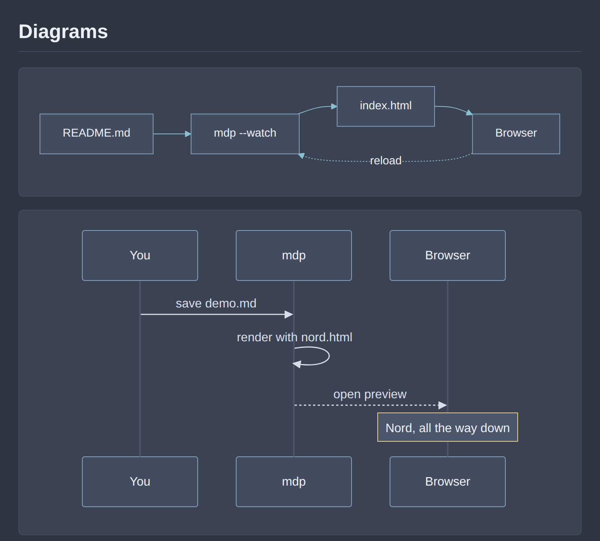
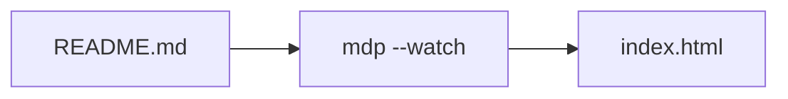

# mdp-nord

A [Nord](https://www.nordtheme.com/) theme for
[masawada/mdp](https://github.com/masawada/mdp) — an arctic, north-bluish
color scheme for a clean, dark, low-contrast Markdown preview.

## Preview


*Rendered from [`examples/demo.md`](./examples/demo.md).*

The theme renders Markdown with:

- A dark **Polar Night** background (`#2e3440`) with **Snow Storm** body text (`#d8dee9`)
- **Frost** blues for headings, links, and blockquote accents
- **Aurora** accents for inline code (yellow), checked task-list checkboxes (green), and strikethrough text
- Styling for GFM tables, task lists, footnotes, `<kbd>`, blockquotes, code blocks, and horizontal rules
- [Mermaid](https://mermaid.js.org/) diagrams, rendered in the Nord palette (see below)
- A responsive layout (max width `780px`) that works well on both desktop and mobile

## Installation

`mdp` loads theme templates from a `themes/` directory inside its **config
directory**. The config directory is the directory containing your
`config.yaml`, resolved from (in priority order):

1. The `--config` flag you pass to `mdp`
2. `$UserConfigDir/mdp/config.yaml` (macOS: `~/Library/Application Support/mdp`)
3. `$HOME/.config/mdp/config.yaml` (Linux, or macOS via `$XDG_CONFIG_HOME`)

### 1. Download the theme

Copy `nord.html` into the `themes/` directory under your `mdp` config
directory, keeping the filename `nord.html` (the theme name mdp uses is the
filename without the `.html` extension).

**macOS**

```bash
mkdir -p ~/Library/Application\ Support/mdp/themes
curl -o ~/Library/Application\ Support/mdp/themes/nord.html \
  https://raw.githubusercontent.com/shmokmt/mdp-nord/main/nord.html
```

**Linux**

```bash
mkdir -p ~/.config/mdp/themes
curl -o ~/.config/mdp/themes/nord.html \
  https://raw.githubusercontent.com/shmokmt/mdp-nord/main/nord.html
```

Or clone this repository and copy the file locally:

```bash
git clone https://github.com/shmokmt/mdp-nord.git
mkdir -p ~/.config/mdp/themes        # or the macOS path above
cp mdp-nord/nord.html ~/.config/mdp/themes/nord.html
```

### 2. Enable the theme in your config

Edit (or create) your `config.yaml` in the same config directory and set
`theme` to `nord`:

```yaml
# ~/.config/mdp/config.yaml (or the macOS equivalent)
theme: nord
```

### 3. Run mdp

```bash
mdp README.md
```

Your resulting directory layout should look like this:

```
~/.config/mdp/
├── config.yaml
└── themes/
    └── nord.html
```

## Mermaid diagrams

Fenced blocks tagged `mermaid` are rendered as diagrams, themed with the Nord
palette:



````markdown

````

Notes on how it works:

- The theme loads mermaid from [jsDelivr](https://www.jsdelivr.com/package/npm/mermaid)
  (pinned to a specific version), and only on pages that actually contain a
  `mermaid` block — documents without diagrams make no network request.
- If mermaid can't be loaded, or a diagram doesn't parse, the block stays a
  normal code block so the source is still readable. An unparsable diagram gets
  a red border, with the error in the block's `title` (and in the browser
  console).
- Flowchart, sequence, class, state, ER, gantt, and pie diagrams all pick up
  Nord colors; anything else falls back to mermaid's own defaults for colors the
  theme doesn't set.

### Rendering offline

To render diagrams without hitting the CDN, download `mermaid.min.js` next to
the theme and point `MERMAID_SRC` (near the bottom of `nord.html`) at your copy:

```bash
curl -o ~/.config/mdp/themes/mermaid.min.js \
  https://cdn.jsdelivr.net/npm/mermaid@11/dist/mermaid.min.js
```

```js
var MERMAID_SRC = "file:///home/you/.config/mdp/themes/mermaid.min.js";
```

Browsers differ in how willing they are to load a `file://` script from a page
in another directory; if yours refuses, serve `mermaid.min.js` over `http://`
instead. Either way a script that fails to load leaves the diagrams as plain
code blocks.

Bumping the pinned version in `MERMAID_SRC` is also how you upgrade mermaid.

## Using it for a single file only

If you don't want to set Nord as your global default theme, point `--config`
at a dedicated config file that has `theme: nord` set, and use it only when
you want the Nord look:

```bash
mdp --config ~/.config/mdp/nord-config.yaml README.md
```

## Credits

- Color palette: [Nord](https://www.nordtheme.com/) by Sven Greb, licensed
  under [MIT](https://github.com/nordtheme/nord/blob/develop/LICENSE.md).
- Theme template for [mdp](https://github.com/masawada/mdp).

## License

MIT — see [LICENSE](./LICENSE).
