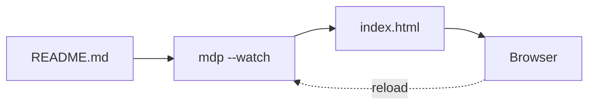
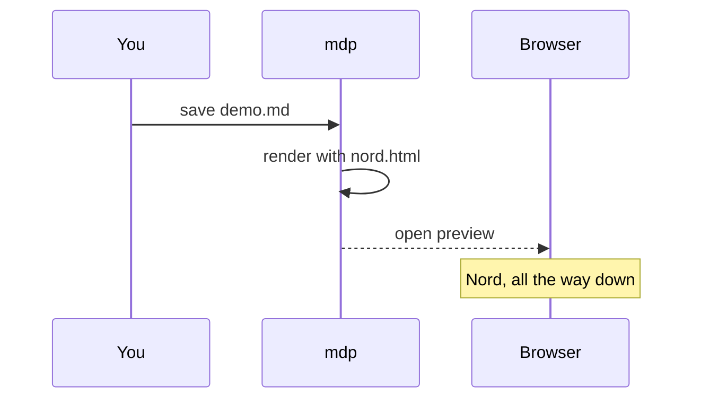

# Nord Theme for mdp

An arctic, north-bluish color palette for [mdp](https://github.com/masawada/mdp),
based on [Nord](https://www.nordtheme.com/).

## Features

- Clean, **dark**, low-contrast reading experience
- Styling for GFM tables, task lists, footnotes, and code blocks
- Mermaid diagrams rendered in the Nord palette
- Responsive layout for desktop and mobile

## Task list

- [x] Polar Night background
- [x] Frost accents for links and headings
- [ ] Light variant

## Palette

| Group        | Name    | Hex       |
|--------------|---------|-----------|
| Polar Night  | nord0   | `#2E3440` |
| Snow Storm   | nord6   | `#ECEFF4` |
| Frost        | nord8   | `#88C0D0` |
| Aurora       | nord14  | `#A3BE8C` |

## Code

```go
func main() {
    fmt.Println("hello, nord")
}
```

## Diagrams





> "Nord" is inspired by the arctic, the beauty of the aurora and the
> majesty of the polar night.

Read more in the [Nord documentation](https://www.nordtheme.com/docs/colors-and-palettes)[^1].

[^1]: Nord is licensed under the MIT license.
